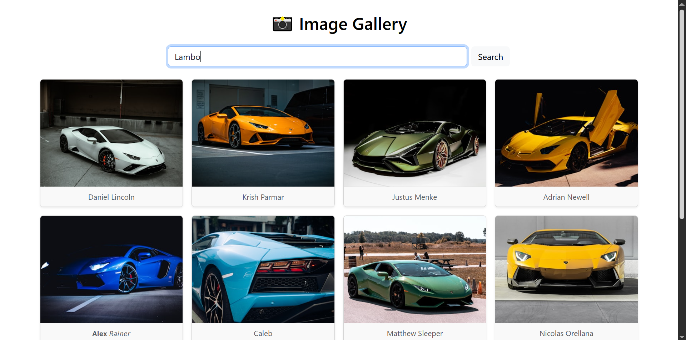

# 📸 Image Gallery App

A responsive and dynamic image gallery built using **React**, **Axios**, and the **Unsplash API**. Users can search for any image, browse results, and load more images with a smooth UI experience.

 

## 📸 Demo

 

## 🚀 Features

- 🔍 Search images from Unsplash API
- 📥 Load more results with pagination
- 🎨 Clean and responsive Bootstrap layout
- 🖼️ Image cards with hover effect and author credit

 

## 🛠️ Tech Stack

- ReactJS
- Bootstrap
- Axios
- Unsplash API

 

## 📦 Installation

1. Clone the repository  
2. Run `npm install`  
3. Add your Unsplash API key inside `App.jsx`  
4. Run with `npm run dev` or `npm start`

 

## 🔑 API Used

- [Unsplash Developer API](https://unsplash.com/developers)

---

## 🧠 What I Practiced

- API integration with Axios  
- React state and effects  
- Component layout with Bootstrap  
- Pagination logic and user interaction

 

## 🧾 License

This project is open-source and free to use.
